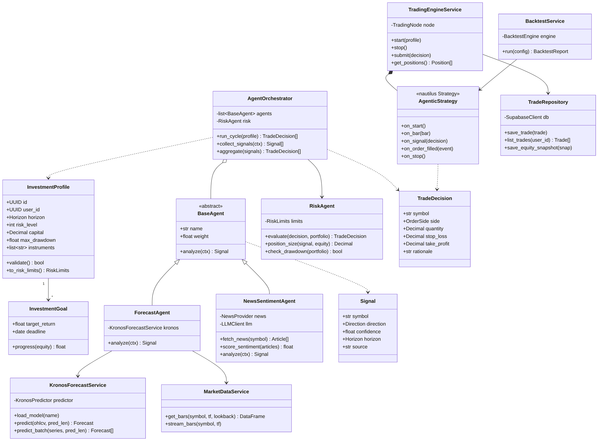
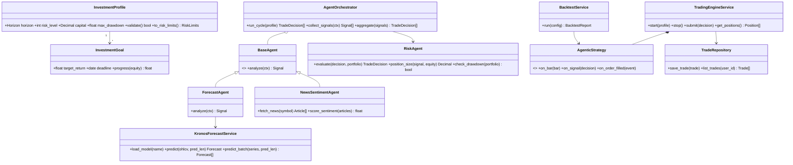
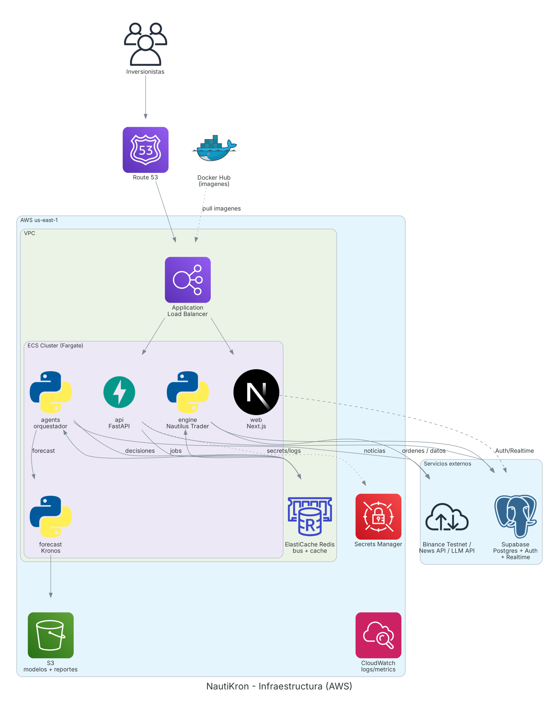
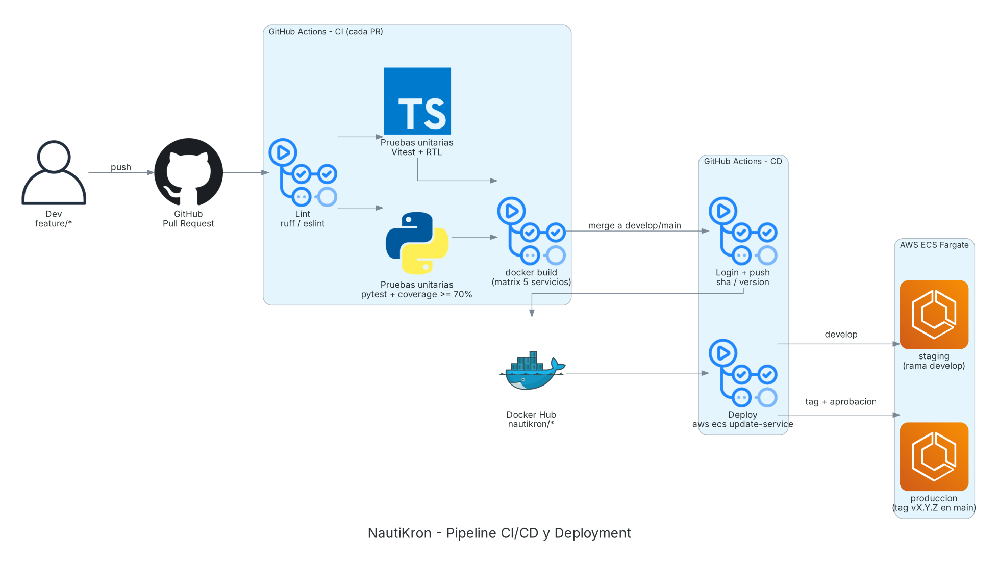
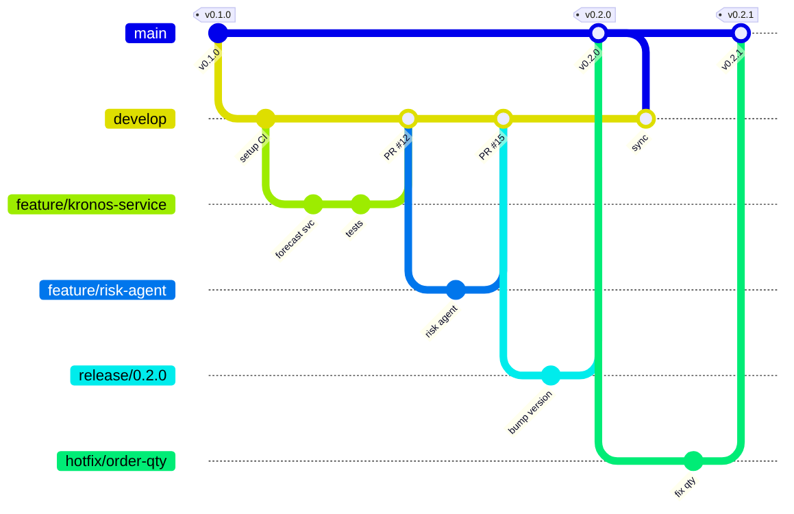

# NautiKron — Plataforma agéntica de trading

**Propuesta de proyecto final · Infraestructura para el Desarrollo Continuo · ITESO · Otoño 2026**

> Repositorio: `CarloSantoro21/trading_maxxing` · Project Board: *NautiKron Roadmap*

---

## 1. Título

**NautiKron: plataforma agéntica de trading configurable, impulsada por pronósticos de series de tiempo (Kronos) y ejecutada sobre un motor de trading event-driven (NautilusTrader).**

## 2. Descripción del proyecto

NautiKron es una aplicación web en la que un usuario define su **perfil de inversión** (capital, horizonte corto/mediano/largo plazo, nivel de riesgo 1–5, drawdown máximo, instrumentos y metas) y un conjunto de **agentes de IA** analiza el mercado de forma continua para proponer y ejecutar operaciones de manera rápida y controlada.

**Problema.** Los inversionistas minoristas no pueden vigilar el mercado todo el día ni reaccionar a noticias a tiempo, y las herramientas de trading algorítmico existentes son difíciles de configurar y no se adaptan a los objetivos personales de cada usuario.

**Solución.** Un sistema multi-agente que:

1. **Pronostica precios** con *Kronos*, un modelo fundacional open-source entrenado con velas (OHLCV) de más de 45 bolsas.
2. **Interpreta noticias** con un agente de sentimiento basado en LLM y ajusta la convicción de las señales ante eventos de mercado.
3. **Controla el riesgo**: un agente de riesgo dimensiona cada posición según el perfil del usuario, aplica stop-loss / take-profit y detiene la operación si se rebasa el drawdown máximo.
4. **Ejecuta** las decisiones sobre *NautilusTrader*, un motor de trading con núcleo en Rust, que permite usar **el mismo código de estrategia en backtest y en vivo**.
5. **Visualiza** en un dashboard Next.js el portafolio, P&L en tiempo real, la justificación (*rationale*) de cada operación y el avance hacia las metas.

**Alcance del MVP (semestre).** Mercado cripto (BTC/USDT, ETH/USDT) en **Binance Spot Testnet (paper trading, sin dinero real)**, backtesting histórico, 3 perfiles de horizonte y 5 niveles de riesgo. Fuera de alcance: dinero real, acciones/forex, entrenamiento propio de modelos (solo inferencia y, opcionalmente, fine-tuning ligero).

### 2.1 Reutilización de código existente

| Repositorio | Qué aporta | Cómo lo integramos | Licencia |
|---|---|---|---|
| [nautechsystems/nautilus_trader](https://github.com/nautechsystems/nautilus_trader) | Motor event-driven con núcleo Rust y control desde Python: `TradingNode` (vivo), `BacktestEngine`, `Strategy`, `RiskEngine`, cache, message bus (Redis opcional) y adaptadores a Binance, Bybit, Coinbase, Kraken, Interactive Brokers, etc. | Dependencia vía `pip` (versión fijada). Escribimos `AgenticStrategy` (hereda de `Strategy`) que recibe `TradeDecision` del orquestador y las convierte en órdenes; usamos el adaptador de Binance en modo testnet y `BacktestEngine` para el servicio de backtests. Imagen base: `ghcr.io/nautechsystems/nautilus_trader`. | LGPL-3.0 (uso como librería sin modificar el código: compatible) |
| [shiyu-coder/Kronos](https://github.com/shiyu-coder/Kronos) | Modelo fundacional para velas financieras. `KronosTokenizer` + `Kronos` + `KronosPredictor.predict()` / `predict_batch()` sobre DataFrames OHLCV; modelos en Hugging Face (`Kronos-mini` 4.1M, `Kronos-small` 24.7M, `Kronos-base` 102.3M parámetros). | Lo envolvemos en un microservicio FastAPI (`forecast`) que expone `/predict`. Usamos `Kronos-small` (corre en CPU, contexto 512 velas). El `ForecastAgent` convierte el pronóstico en una señal (dirección + confianza). | MIT |

**Por qué estos repos encajan:** NautilusTrader resuelve la parte difícil y crítica (ejecución, órdenes, riesgo, backtest determinista), pero **deliberadamente no incluye UI, orquestación distribuida ni IA**. Kronos aporta la IA de pronóstico pero **no ejecuta operaciones** (su propio README advierte que no es un sistema de trading listo para producción). NautiKron construye exactamente lo que falta: la capa agéntica, la configuración por perfil, la UI y la infraestructura.

## 3. Componentes y métodos

| Componente | Responsabilidad | Métodos principales |
|---|---|---|
| `web` (Next.js) | Onboarding, configuración de perfil, dashboard en tiempo real, backtests | Páginas: `/onboarding`, `/dashboard`, `/strategies`, `/backtests`, `/trades` |
| `api` (FastAPI) | API REST, validación, orquestación de jobs | `POST /profiles`, `GET /portfolio`, `POST /backtests`, `POST /bots/{id}/start|stop`, `GET /trades` |
| `InvestmentProfile` | Preferencias del usuario | `validate()`, `to_risk_limits()` |
| `InvestmentGoal` | Metas de rendimiento | `progress(equity)` |
| `AgentOrchestrator` | Ciclo de decisión multi-agente | `run_cycle(profile)`, `collect_signals(ctx)`, `aggregate(signals)` |
| `BaseAgent` (abstracta) | Contrato común de agentes | `analyze(ctx) -> Signal` |
| `ForecastAgent` | Señal a partir de Kronos | `analyze(ctx)` |
| `NewsSentimentAgent` | Señal a partir de noticias + LLM | `fetch_news(symbol)`, `score_sentiment(articles)`, `analyze(ctx)` |
| `RiskAgent` | Dimensionamiento y límites | `evaluate(decision, portfolio)`, `position_size(signal, equity)`, `check_drawdown(portfolio)` |
| `KronosForecastService` | Inferencia de Kronos | `load_model(name)`, `predict(ohlcv, pred_len)`, `predict_batch(series, pred_len)` |
| `MarketDataService` | Velas históricas y streaming | `get_bars(symbol, tf, lookback)`, `stream_bars(symbol, tf)` |
| `TradingEngineService` | Envuelve el `TradingNode` de Nautilus | `start(profile)`, `stop()`, `submit(decision)`, `get_positions()` |
| `AgenticStrategy` (Nautilus `Strategy`) | Traduce decisiones a órdenes | `on_start()`, `on_bar(bar)`, `on_signal(decision)`, `on_order_filled(event)`, `on_stop()` |
| `BacktestService` | Backtests con `BacktestEngine` | `run(config) -> BacktestReport` |
| `TradeRepository` | Persistencia en Supabase | `save_trade(trade)`, `list_trades(user_id)`, `save_equity_snapshot(snap)` |

### 3.1 Diagrama de clases

### 3.2 Flujo de una decisión

1. Cada cierre de vela (p. ej. 15 min), el orquestador arma el contexto: últimas 400 velas + noticias de las últimas horas + portafolio actual.
2. `ForecastAgent` llama a `forecast /predict` (Kronos, 24 velas a futuro, `sample_count=5`) → dirección esperada y confianza (dispersión de las trayectorias).
3. `NewsSentimentAgent` puntúa el sentimiento (−1 a 1) y puede vetar una entrada ante noticias de alto impacto.
4. `aggregate()` pondera las señales según el horizonte del perfil (corto plazo: más peso a Kronos; largo plazo: más peso a tendencia y sentimiento).
5. `RiskAgent` dimensiona la posición (riesgo por operación = f(nivel de riesgo)), fija stop-loss / take-profit y valida el drawdown.
6. La `TradeDecision` se publica en Redis → `AgenticStrategy` en Nautilus envía la orden a Binance Testnet → el fill se guarda en Supabase → el dashboard se actualiza por Supabase Realtime.

## 4. Stack tecnológico

| Capa | Tecnología | Justificación |
|---|---|---|
| Frontend | **Next.js 15 (App Router) + TypeScript + Tailwind + shadcn/ui + Recharts** | SSR, rutas protegidas, gráficas de velas y P&L |
| Backend API | **FastAPI (Python 3.12) + Pydantic** | Mismo lenguaje que Nautilus y Kronos; tipado y OpenAPI automático |
| Agentes | Python 3.12, cliente LLM (Claude/OpenAI vía API), APIs de noticias (Finnhub / CryptoPanic) | Lógica de decisión desacoplada en un worker |
| Pronóstico | **Kronos-small** (PyTorch, CPU) servido con FastAPI | Modelo ligero (24.7M) que no requiere GPU |
| Motor de trading | **NautilusTrader** (núcleo Rust, Python 3.12–3.14) | Ejecución y backtest con el mismo código |
| Base de datos y auth | **Supabase** (Postgres + Auth + Realtime + RLS) | Auth lista, tiempo real para el dashboard, seguridad por fila |
| Mensajería / cache | **Redis** (ElastiCache en la nube, contenedor en local) | Cola de jobs y canal de decisiones; backend opcional del cache de Nautilus |
| Contenedores | **Docker + Docker Compose**; registro en **Docker Hub** | Un contenedor por servicio, mismo artefacto en todos los ambientes |
| CI/CD | **GitHub Actions** | Lint, pruebas, build y push a Docker Hub, deploy |
| Nube | **AWS**: ECS Fargate, ALB, ElastiCache, Secrets Manager, CloudWatch, S3, Route 53 | Contenedores sin administrar servidores |
| Calidad | pytest + pytest-cov, Vitest + React Testing Library, ruff, ESLint, Prettier | Pruebas unitarias y estilo en CI |

**¿Es el stack correcto?** Sí: Next.js + FastAPI + Supabase funciona bien. Los dos ajustes que recomendamos son **(1) agregar Redis**, porque el motor de trading y los agentes necesitan comunicarse de forma asíncrona y Nautilus ya lo soporta de forma nativa, y **(2) fijar Python 3.12**, la versión que cumple a la vez los requisitos de Nautilus (3.12–3.14) y de Kronos (3.10+). Usaremos la línea v2 de NautilusTrader fijando versión exacta, porque su API todavía puede cambiar entre versiones.

## 5. Recursos que se van a crear (infraestructura)

| Recurso | Tipo | Propósito |
|---|---|---|
| `nautikron-vpc` | VPC con 2 subredes públicas + 2 privadas | Aislamiento de red |
| `nautikron-alb` | Application Load Balancer | Enruta `/` → web y `/api` → api |
| `nautikron-cluster` | ECS Cluster (Fargate) | Ejecuta los contenedores |
| `web`, `api`, `agents`, `forecast`, `engine` | 5 ECS Services / Task Definitions | Un servicio por contenedor |
| `nautikron-redis` | ElastiCache Redis | Bus de decisiones + cola de jobs |
| `nautikron/*` | Secrets Manager | Claves de Binance Testnet, Supabase, LLM y API de noticias |
| `/ecs/nautikron` | CloudWatch Log Groups + alarmas | Logs, métricas y alerta de drawdown |
| `nautikron-artifacts` | S3 | Pesos del modelo en caché y reportes de backtest |
| Proyecto Supabase | SaaS | Postgres (perfiles, trades, snapshots), Auth, Realtime |
| `nautikron/web`, `/api`, `/agents`, `/forecast`, `/engine` | Repositorios en **Docker Hub** | Imágenes versionadas |

Ambiente local: `docker-compose.yml` levanta los 5 servicios + Redis apuntando a un proyecto Supabase de desarrollo.

### 5.1 Diagrama de deployment (CI/CD)

**Pipeline:**

| Evento | Jobs |
|---|---|
| Pull Request a `develop` / `main` | `lint` (ruff, ESLint) → `test-python` (pytest, cobertura ≥ 70 %) y `test-web` (Vitest) en paralelo → `docker-build` (matriz de 5 servicios, sin push) |
| Merge a `develop` | Todo lo anterior + push a Docker Hub con tags `develop` y `sha-<commit>` → deploy automático a **staging** |
| Tag `vX.Y.Z` en `main` | Push a Docker Hub con tags `X.Y.Z` y `latest` → deploy a **producción** con aprobación manual (GitHub Environments) |

#### Pruebas unitarias

| Módulo | Qué se prueba | Herramienta |
|---|---|---|
| `RiskAgent` | Tamaño de posición por nivel de riesgo, stop-loss/take-profit, bloqueo por drawdown | pytest |
| `AgentOrchestrator` | Agregación y pesos por horizonte, manejo de señales contradictorias | pytest + mocks |
| `ForecastAgent` / `KronosForecastService` | Conversión de pronóstico a señal; contrato de `/predict` con un predictor simulado (sin descargar el modelo en CI) | pytest + `unittest.mock` |
| `NewsSentimentAgent` | Parseo de noticias y puntuación con LLM simulado | pytest + respx |
| `AgenticStrategy` | Órdenes correctas ante una `TradeDecision`, usando `BacktestEngine` con datos de prueba | pytest + Nautilus |
| API | Validación de perfiles, endpoints y auth | pytest + `TestClient` |
| Web | Formulario de perfil, componentes del dashboard | Vitest + React Testing Library |

Regla de calidad: ningún PR se fusiona con pruebas fallidas o con cobertura de Python menor a 70 %.

#### Docker Hub

- Organización/usuario: `nautikron` (o el usuario del equipo).
- Una imagen por servicio: `nautikron/web`, `nautikron/api`, `nautikron/agents`, `nautikron/forecast`, `nautikron/engine`.
- Tags: `sha-<commit>` (trazabilidad), `develop` (staging), `X.Y.Z` y `latest` (producción).
- Builds multi-stage; `engine` parte de la imagen oficial de NautilusTrader; `forecast` descarga los pesos de Kronos en build para arranque rápido.
- Credenciales en *GitHub Secrets* (`DOCKERHUB_USERNAME`, `DOCKERHUB_TOKEN`).

### 5.2 Estrategia de ramas

Usamos **Git Flow simplificado**:

| Rama | Propósito | Reglas |
|---|---|---|
| `main` | Código en producción | Protegida; solo recibe merges de `release/*` y `hotfix/*`; cada merge lleva tag `vX.Y.Z` |
| `develop` | Integración; se despliega a staging | Protegida; PR con 1 aprobación + CI en verde |
| `feature/<issue>-<descripcion>` | Nueva funcionalidad (p. ej. `feature/14-risk-agent`) | Sale de `develop`, regresa por PR con squash merge |
| `release/X.Y.Z` | Estabilización antes de liberar | Sale de `develop`; solo correcciones |
| `hotfix/<descripcion>` | Corrección urgente en producción | Sale de `main`; se fusiona a `main` y `develop` |

Convenciones: *Conventional Commits* (`feat:`, `fix:`, `test:`, `ci:`, `docs:`), cada PR enlaza su issue (`Closes #14`) y versionado semántico.

## 6. Plan de trabajo

El plan vive en el **GitHub Project Board "NautiKron Roadmap"** (columnas *Backlog → To Do → In Progress → In Review → Done*), con issues etiquetados por área (`frontend`, `backend`, `agents`, `ml`, `trading-engine`, `devops`, `testing`, `docs`) y agrupados en milestones:

| Milestone | Fechas (aprox.) | Entregables |
|---|---|---|
| M1 · Fundaciones e infraestructura | 5 – 18 oct | Repo, ramas protegidas, monorepo, Docker Compose, CI básico, Supabase, Wiki |
| M2 · Motor y pronóstico | 19 oct – 1 nov | Servicio Kronos, integración Nautilus (backtest + testnet), datos de mercado |
| M3 · Agentes y API | 2 – 15 nov | Agentes de pronóstico, noticias y riesgo; orquestador; API REST |
| M4 · Frontend y deployment | 16 – 29 nov | Dashboard, onboarding, backtests en UI, CD a AWS + Docker Hub |
| M5 · Cierre | 30 nov – 6 dic | Pruebas end-to-end, documentación, demo final |

El detalle de issues (≈30) está en el board; cada uno incluye descripción, criterios de aceptación, labels y milestone.

## 7. Riesgos y mitigaciones

| Riesgo | Mitigación |
|---|---|
| API de NautilusTrader v2 cambia entre versiones | Fijar versión exacta e imagen base por digest |
| Kronos lento en CPU | Usar `Kronos-small`/`mini`, `predict_batch`, cachear pronósticos por vela |
| Pérdidas por señales malas | Solo paper trading (testnet); `RiskAgent` con drawdown máximo y botón de paro |
| Costos de AWS | Fargate con tareas mínimas, apagar staging fuera de horario, Free Tier |
| Límites de APIs de noticias/LLM | Cache en Redis y llamadas solo al cierre de vela |

> **Aviso:** NautiKron es un proyecto académico. Opera solo en entornos de prueba y no constituye asesoría financiera.
