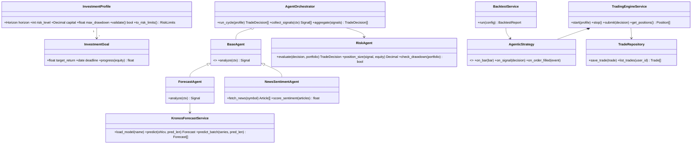

# trading_maxxing — Propuesta de proyecto final

Infraestructura para el Desarrollo Continuo · ITESO · Otoño 2026

Repositorio: https://github.com/CarloSantoro21/trading_maxxing

Project Board: https://github.com/users/CarloSantoro21/projects/2

## 1. Título

trading_maxxing: plataforma agéntica de trading configurable, basada en pronósticos de series de tiempo (Kronos) y ejecutada sobre un motor de trading event-driven (NautilusTrader).

## 2. Descripción del proyecto

trading_maxxing es una aplicación web en la que el usuario define su perfil de inversión (capital, horizonte de corto, mediano o largo plazo, nivel de riesgo del 1 al 5, drawdown máximo, instrumentos y metas) y un conjunto de agentes de IA analiza el mercado de forma continua para proponer y ejecutar operaciones de manera rápida y controlada.

Problema. Un inversionista individual no puede vigilar el mercado todo el día ni reaccionar a tiempo a las noticias, y las herramientas de trading algorítmico existentes son difíciles de configurar y no se adaptan a los objetivos de cada persona.

Solución. Un sistema multi-agente que:

1. Pronostica precios con Kronos, un modelo fundacional open-source entrenado con velas (OHLCV) de más de 45 bolsas.
2. Interpreta noticias con un agente de sentimiento basado en un LLM y ajusta la confianza de las señales ante eventos de mercado.
3. Controla el riesgo: un agente dimensiona cada posición según el perfil del usuario, aplica stop-loss y take-profit, y detiene la operación si se rebasa el drawdown máximo.
4. Ejecuta las decisiones sobre NautilusTrader, un motor con núcleo en Rust que permite usar el mismo código de estrategia en backtest y en vivo.
5. Muestra en un dashboard el portafolio, el P&L en tiempo real, la justificación de cada operación y el avance hacia las metas.

Alcance del MVP. Mercado cripto (BTC/USDT y ETH/USDT) en Binance Spot Testnet, es decir, paper trading sin dinero real; backtesting con datos históricos; 3 horizontes y 5 niveles de riesgo. Queda fuera del alcance operar con dinero real, acciones o forex, y entrenar modelos propios (solo inferencia y, si da tiempo, un fine-tuning ligero).

### 2.1 Código que vamos a reutilizar

NautilusTrader (https://github.com/nautechsystems/nautilus_trader, licencia LGPL-3.0)

- Qué aporta: motor event-driven con núcleo en Rust controlado desde Python. Incluye TradingNode para operar en vivo, BacktestEngine, la clase base Strategy, un RiskEngine, cache, message bus con Redis opcional y adaptadores para Binance, Bybit, Coinbase, Kraken e Interactive Brokers, entre otros.
- Cómo lo usamos: como dependencia instalada con pip, con versión fija. Escribimos AgenticStrategy, que hereda de Strategy, recibe las decisiones del orquestador y las convierte en órdenes. Usamos el adaptador de Binance en modo testnet y BacktestEngine para el servicio de backtests. La imagen Docker del motor parte de la imagen oficial ghcr.io/nautechsystems/nautilus_trader.
- Licencia: la LGPL permite usarlo como librería sin modificar su código.

Kronos (https://github.com/shiyu-coder/Kronos, licencia MIT)

- Qué aporta: modelo fundacional para velas financieras. Se usa con KronosTokenizer, Kronos y KronosPredictor, cuyos métodos predict() y predict_batch() reciben un DataFrame OHLCV. Los modelos están en Hugging Face: Kronos-mini (4.1M parámetros), Kronos-small (24.7M) y Kronos-base (102.3M).
- Cómo lo usamos: lo envolvemos en un microservicio FastAPI (forecast) que expone /predict. Usamos Kronos-small, que corre en CPU con un contexto de 512 velas. El ForecastAgent convierte el pronóstico en una señal con dirección y confianza.

Por qué encajan. NautilusTrader resuelve la parte crítica (ejecución, órdenes, riesgo y backtest determinista), pero por diseño no incluye interfaz, orquestación distribuida ni IA. Kronos aporta el pronóstico, pero no ejecuta operaciones y su README aclara que no es un sistema de trading listo para producción. trading_maxxing construye lo que falta entre los dos: la capa de agentes, la configuración por perfil, la interfaz y la infraestructura.

## 3. Componentes y métodos

| Componente | Responsabilidad | Métodos principales |
|---|---|---|
| web (Next.js) | Onboarding, perfil, dashboard en tiempo real, backtests | Páginas /onboarding, /dashboard, /strategies, /backtests, /trades |
| api (FastAPI) | API REST, validación, disparo de jobs | POST /profiles, GET /portfolio, POST /backtests, POST /bots/{id}/start, POST /bots/{id}/stop, GET /trades |
| InvestmentProfile | Preferencias del usuario | validate(), to_risk_limits() |
| InvestmentGoal | Metas de rendimiento | progress(equity) |
| AgentOrchestrator | Ciclo de decisión multi-agente | run_cycle(profile), collect_signals(ctx), aggregate(signals) |
| BaseAgent (abstracta) | Contrato común de los agentes | analyze(ctx) -> Signal |
| ForecastAgent | Señal a partir de Kronos | analyze(ctx) |
| NewsSentimentAgent | Señal a partir de noticias y un LLM | fetch_news(symbol), score_sentiment(articles), analyze(ctx) |
| RiskAgent | Tamaño de posición y límites | evaluate(decision, portfolio), position_size(signal, equity), check_drawdown(portfolio) |
| KronosForecastService | Inferencia de Kronos | load_model(name), predict(ohlcv, pred_len), predict_batch(series, pred_len) |
| MarketDataService | Velas históricas y en tiempo real | get_bars(symbol, tf, lookback), stream_bars(symbol, tf) |
| TradingEngineService | Envuelve el TradingNode de Nautilus | start(profile), stop(), submit(decision), get_positions() |
| AgenticStrategy (Strategy de Nautilus) | Convierte decisiones en órdenes | on_start(), on_bar(bar), on_signal(decision), on_order_filled(event), on_stop() |
| BacktestService | Backtests con BacktestEngine | run(config) -> BacktestReport |
| TradeRepository | Persistencia en Supabase | save_trade(trade), list_trades(user_id), save_equity_snapshot(snap) |

### 3.1 Diagrama de clases

### 3.2 Flujo de una decisión

1. Al cierre de cada vela (por ejemplo, cada 15 minutos), el orquestador arma el contexto: las últimas 400 velas, las noticias de las últimas horas y el portafolio actual.
2. ForecastAgent llama a /predict del servicio forecast (24 velas a futuro, 5 trayectorias) y obtiene la dirección esperada y una confianza calculada a partir de la dispersión de las trayectorias.
3. NewsSentimentAgent puntúa el sentimiento entre -1 y 1 y puede vetar una entrada ante noticias de alto impacto.
4. aggregate() pondera las señales según el horizonte del perfil: en corto plazo pesa más Kronos y en largo plazo pesan más la tendencia y el sentimiento.
5. RiskAgent calcula el tamaño de la posición según el nivel de riesgo, fija stop-loss y take-profit y revisa el drawdown.
6. La decisión se publica en Redis, AgenticStrategy envía la orden a Binance Testnet, el resultado se guarda en Supabase y el dashboard se actualiza con Supabase Realtime.

## 4. Stack tecnológico

- Frontend: Next.js 15 (App Router), TypeScript, Tailwind, shadcn/ui y Recharts.
- Backend: FastAPI con Pydantic sobre Python 3.12, el mismo lenguaje que Nautilus y Kronos.
- Agentes: worker en Python 3.12 con un cliente de LLM (Claude u OpenAI) y una API de noticias (Finnhub o CryptoPanic).
- Pronóstico: Kronos-small con PyTorch en CPU, servido con FastAPI.
- Motor de trading: NautilusTrader.
- Base de datos y autenticación: Supabase (Postgres, Auth, Realtime y Row Level Security).
- Mensajería y cache: Redis (ElastiCache en la nube, contenedor en local).
- Contenedores: Docker y Docker Compose, con las imágenes publicadas en Docker Hub.
- CI/CD: GitHub Actions.
- Nube: AWS (ECS Fargate, Application Load Balancer, ElastiCache, Secrets Manager, CloudWatch, S3 y Route 53).
- Calidad: pytest y pytest-cov, Vitest y React Testing Library, ruff, ESLint y Prettier.

Sobre el stack propuesto. Next.js, FastAPI y Supabase funcionan bien para este proyecto. Hacemos dos ajustes: agregamos Redis, porque los agentes y el motor de trading necesitan comunicarse de forma asíncrona y Nautilus ya lo soporta, y fijamos Python 3.12, que es la versión que cumple a la vez con Nautilus (3.12 a 3.14) y con Kronos (3.10 o superior). De NautilusTrader usaremos la línea v2 con una versión exacta, porque su API todavía puede cambiar entre versiones.

## 5. Recursos que se van a crear

| Recurso | Tipo | Propósito |
|---|---|---|
| trading-maxxing-vpc | VPC con 2 subredes públicas y 2 privadas | Aislamiento de red |
| trading-maxxing-alb | Application Load Balancer | Enruta / a web y /api a api |
| trading-maxxing-cluster | ECS Cluster (Fargate) | Ejecuta los contenedores |
| web, api, agents, forecast, engine | 5 servicios de ECS | Un servicio por contenedor |
| trading-maxxing-redis | ElastiCache Redis | Canal de decisiones y cola de jobs |
| trading-maxxing/* | Secrets Manager | Claves de Binance Testnet, Supabase, LLM y API de noticias |
| /ecs/trading-maxxing | CloudWatch Logs y alarmas | Logs, métricas y alerta de drawdown |
| trading-maxxing-artifacts | S3 | Pesos del modelo y reportes de backtest |
| Proyecto de Supabase | SaaS | Postgres, Auth y Realtime |
| trading-maxxing-web, -api, -agents, -forecast, -engine | Repositorios en Docker Hub | Imágenes versionadas |

En local, docker-compose.yml levanta los 5 servicios y Redis, conectados a un proyecto de Supabase de desarrollo.

### 5.1 Diagrama de deployment

El pipeline corre en GitHub Actions:

- En cada pull request a develop o main: lint (ruff y ESLint), pruebas de Python con pytest (cobertura mínima de 70 %) y pruebas del frontend con Vitest en paralelo, y build de las 5 imágenes sin publicarlas.
- Al hacer merge a develop: lo anterior, más el push de las imágenes a Docker Hub con los tags develop y `sha-<commit>`, y deploy automático a staging.
- Al crear un tag vX.Y.Z en main: push a Docker Hub con los tags X.Y.Z y latest, y deploy a producción con aprobación manual mediante GitHub Environments.

#### Pruebas unitarias

- RiskAgent: tamaño de posición por nivel de riesgo, stop-loss y take-profit, y bloqueo por drawdown (pytest).
- AgentOrchestrator: agregación y pesos por horizonte, y manejo de señales contradictorias (pytest con mocks).
- ForecastAgent y KronosForecastService: conversión del pronóstico a señal y contrato de /predict con un predictor simulado, para no descargar el modelo en CI (pytest y unittest.mock).
- NewsSentimentAgent: lectura de noticias y puntuación con un LLM simulado (pytest y respx).
- AgenticStrategy: órdenes correctas ante una decisión, usando BacktestEngine con datos de prueba (pytest y Nautilus).
- API: validación de perfiles, endpoints y autenticación (pytest y TestClient).
- Web: formulario de perfil y componentes del dashboard (Vitest y React Testing Library).

Ningún pull request se fusiona con pruebas fallidas o con cobertura de Python menor a 70 %.

#### Docker Hub

- Una imagen por servicio, bajo la cuenta del equipo: trading-maxxing-web, trading-maxxing-api, trading-maxxing-agents, trading-maxxing-forecast y trading-maxxing-engine.
- Tags: `sha-<commit>` para trazabilidad, develop para staging, y X.Y.Z y latest para producción.
- Builds multi-stage. La imagen engine parte de la imagen oficial de NautilusTrader y la imagen forecast descarga los pesos de Kronos durante el build para arrancar rápido.
- Las credenciales viven en GitHub Secrets (DOCKERHUB_USERNAME y DOCKERHUB_TOKEN).

### 5.2 Estrategia de ramas

Usamos Git Flow simplificado:

- main: código en producción. Protegida; solo recibe merges de `release/*` y `hotfix/*`, y cada merge lleva un tag vX.Y.Z.
- develop: rama de integración, desplegada en staging. Protegida; requiere pull request con una aprobación y CI en verde.
- `feature/<issue>-<descripcion>`: nuevas funcionalidades, por ejemplo feature/18-risk-agent. Sale de develop y regresa por pull request con squash merge.
- release/X.Y.Z: estabilización antes de liberar. Sale de develop y solo admite correcciones.
- `hotfix/<descripcion>`: correcciones urgentes en producción. Sale de main y se fusiona en main y develop.

Los commits siguen Conventional Commits (feat:, fix:, test:, ci:, docs:), cada pull request enlaza su issue (Closes #18) y las versiones siguen versionado semántico.

## 6. Plan de trabajo

El plan está en el GitHub Project Board del repositorio (https://github.com/users/CarloSantoro21/projects/2), con columnas Backlog, To Do, In Progress, In Review y Done. Tiene 30 issues, cada uno con descripción, criterios de aceptación, etiquetas por área (frontend, backend, agents, ml, trading-engine, devops, testing, docs, database) y milestone:

- M1, Fundaciones e infraestructura (5 al 18 de octubre): repositorio, ramas protegidas, estructura del monorepo, Docker Compose, CI básico, Supabase y Wiki.
- M2, Motor y pronóstico (19 de octubre al 1 de noviembre): servicio de Kronos, integración con Nautilus (backtest y testnet) y datos de mercado.
- M3, Agentes y API (2 al 15 de noviembre): agentes de pronóstico, noticias y riesgo, orquestador y API REST.
- M4, Frontend y deployment (16 al 29 de noviembre): dashboard, onboarding, backtests en la interfaz y CD a AWS con Docker Hub.
- M5, Cierre (30 de noviembre al 6 de diciembre): pruebas end-to-end, documentación y demo final.

Issues: https://github.com/CarloSantoro21/trading_maxxing/issues

## 7. Riesgos y mitigaciones

- La API de NautilusTrader v2 puede cambiar entre versiones: fijamos la versión exacta y la imagen base por digest.
- Kronos puede ser lento en CPU: usamos Kronos-small o Kronos-mini, predict_batch y cache de pronósticos por vela.
- Señales malas pueden generar pérdidas: operamos solo en testnet y RiskAgent aplica el drawdown máximo y un botón de paro.
- Costos de AWS: tareas de Fargate mínimas, staging apagado fuera de horario y uso del Free Tier.
- Límites de las APIs de noticias y del LLM: cache en Redis y llamadas solo al cierre de vela.

trading_maxxing es un proyecto académico. Opera solo en entornos de prueba y no constituye asesoría financiera.
